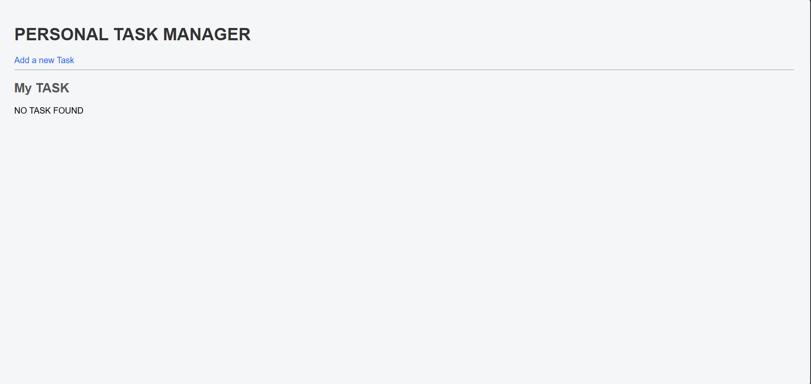
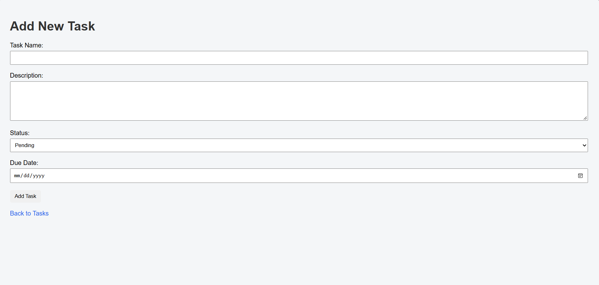
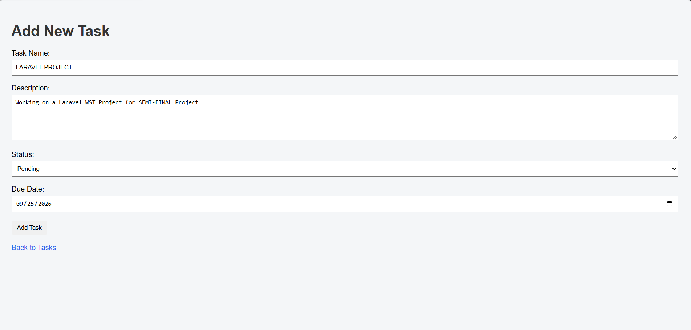
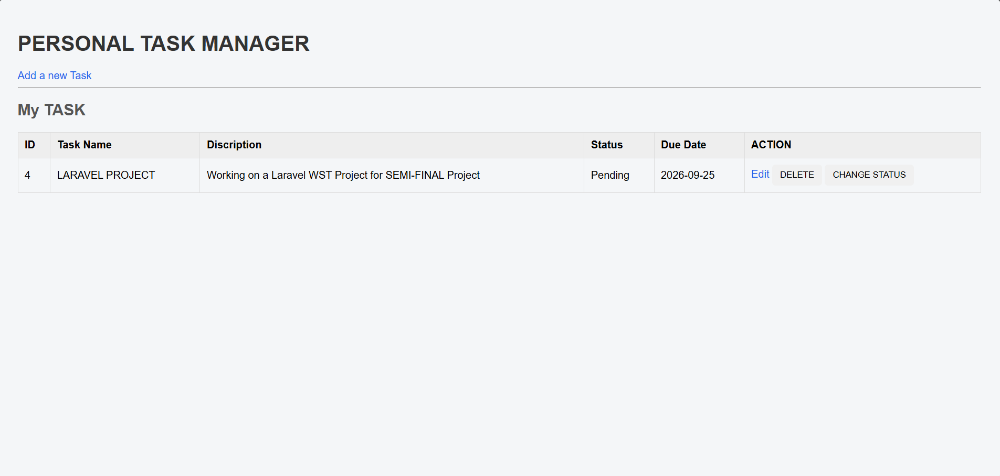
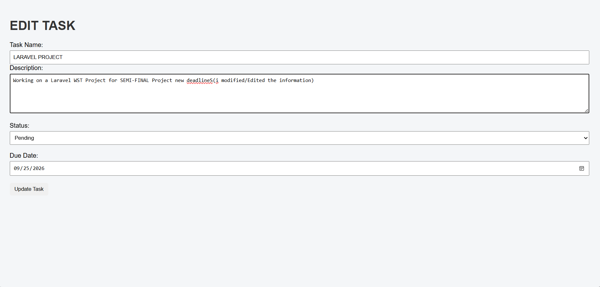
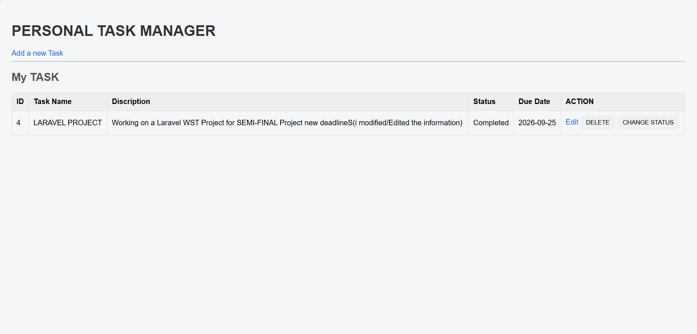
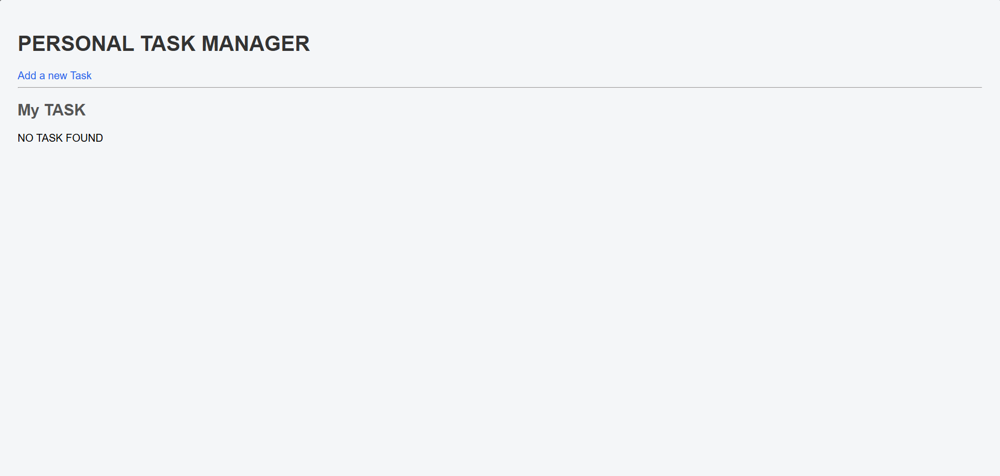

# Personal Task Manager

A simple Laravel-based task management system.

**Project Code:** WST21-PM-2026-SF  
**Student Name:** Sibay Jerris Quinn Benemerito  
**Course & Year:** BSIT – 2ND Year  
**Database Used:** MySQL  

**Features:**
- Add Task
- View Tasks
- Edit Task
- Delete Task
- Update Status

## Web System Flow

### 1. Task List / Home

### 2. Add New Task

### 3. Enter Task Information

### 4. Save Task

### 5. Edit Task

### 6. Save Edited Task

### 7. Change Status

### 8. Delete Task
